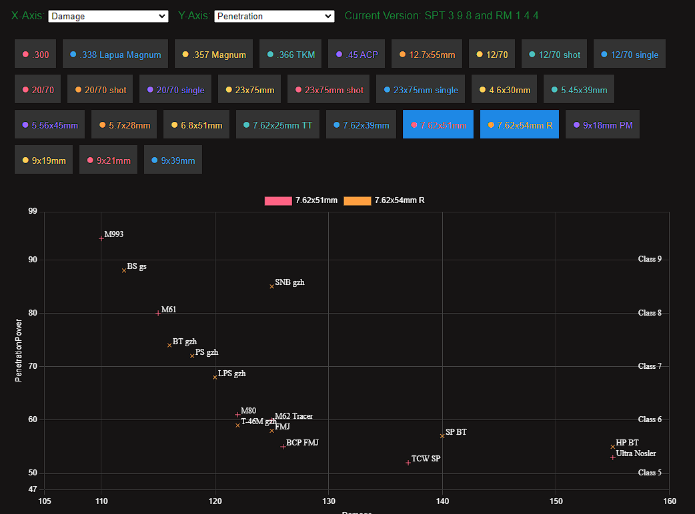

# SPT Realism Ammo Graph
This web application visualizes ammunition data for the SPT Realism Mod, displaying damage and penetration values for different calibers in a scatter plot. Users can select various calibers to compare their performance. The chart dynamically adjusts its axes and includes class labels for penetration levels.


## Files

- **get_live_data.py** A Python script which grabs the latest ammo stats from tarkov.dev and puts them into the ```live_data.json``` file. The script needs the python module requests, which can be installed via ```pip install requests ```
- **live_data.json** A JSON-File which contains the current live Tarkov Ammo-Stats, generated by the ```get_live_data.py``` script. 
- **ammo_reader.py**: A Python script to read and process ammunition data from the realism mod ```ammo.js``` file and generates the ```data.js``` file (Beware of the path in line 5/6).
- - the ammo.js file is located in ```\user\mods\SPT-Realism\src\ballistics\ammo.js``` if you want to update the ```data.js``` file yourself.
- **index.html**: The main HTML file that structures the web page, including the canvas for the chart and buttons for selecting calibers.
- **script.js**: The JavaScript file that handles data processing, chart rendering, and user interactions.
- **data.js**: A JavaScript file containing the ammunition data used by the web application. Currently for SPT 3.9.5 RM 1.4.4

## Usage
Just download the ```index.html```, ```script.js``` and ```data.js```. The rest of the files are examples or to create the ```data.js```.
After downloading open the ```index.html```.

## License

This project is licensed under the MIT License. See the LICENSE file for details.
