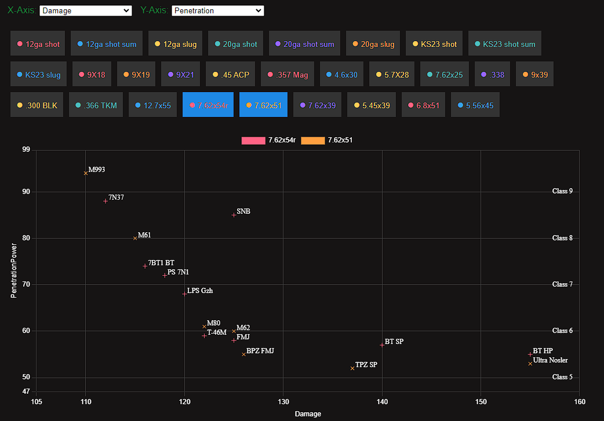

# SPT Realism Ammo Graph
This web application visualizes ammunition data for the SPT Realism Mod, displaying damage and penetration values for different calibers in a scatter plot. Users can select various calibers to compare their performance. The chart dynamically adjusts its axes and includes class labels for penetration levels.

## Files

- **ammo_reader.py**: A Python script to read and process ammunition data from the realism mod ammo.js file and generates a JSON file (Beware of the path in line 5/6).
- **output.json**: The JSON file which was generated by the ammo_reader.py this is the data which has to be put into the **data.js** (for version 3.8.3 it is already done)
- **index.html**: The main HTML file that structures the web page, including the canvas for the chart and buttons for selecting calibers.
- **script.js**: The JavaScript file that handles data processing, chart rendering, and user interactions.
- **data.js**: A JavaScript file containing the ammunition data used by the web application, copy the data from the generated json file.

## Usage
Just download the index.html, script.js and data.js. The rest of the files are examples or to create the data.js.
When downloaded open the index.html.

## License

This project is licensed under the MIT License. See the LICENSE file for details.
